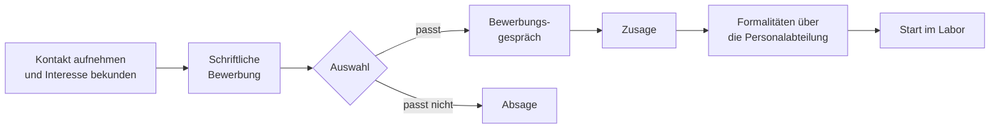
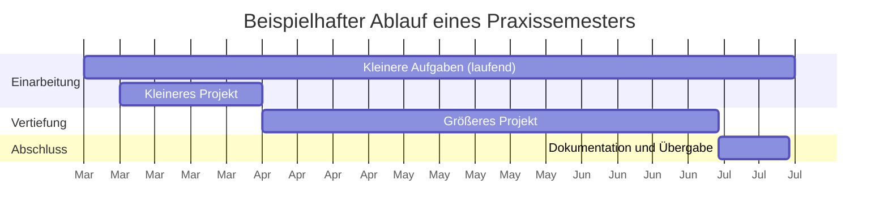

# 🎓 Praxissemester im Smart Home Labor

Im **Praxissemester** (praktischen Studiensemester) arbeitest du ein ganzes Semester in **Vollzeit** im Smart Home Labor. Du übernimmst zum Teil dieselben Aufgaben wie ein [Hiwi](Hiwi.md), gehst aber deutlich darüber hinaus: Du verantwortest **eigene, größere Projekte** – von der Planung über die Entwicklung bis zum dauerhaften Betrieb.

<!-- TOC -->
## Inhaltsverzeichnis

- [Rahmenbedingungen](#rahmenbedingungen)
  - [Arbeitszeit](#arbeitszeit)
  - [Dauer](#dauer)
  - [Vergütung](#vergütung)
  - [Hiwi und Praxissemester im Vergleich](#hiwi-und-praxissemester-im-vergleich)
- [Bewerbung und Bewerbungsgespräch](#bewerbung-und-bewerbungsgespräch)
  - [Ablauf](#ablauf)
  - [Was gehört in die Bewerbung?](#was-gehört-in-die-bewerbung)
  - [Wie bereitest du dich auf das Gespräch vor?](#wie-bereitest-du-dich-auf-das-gespräch-vor)
- [Tätigkeiten im Smart Home Labor](#tätigkeiten-im-smart-home-labor)
  - [Projektdauer und Projektumfang](#projektdauer-und-projektumfang)
  - [Integration vs. Eigenentwicklung](#integration-vs-eigenentwicklung)
  - [Was zu einem Projekt dazugehört](#was-zu-einem-projekt-dazugehört)
- [Was du mitnimmst](#was-du-mitnimmst)
<!-- /TOC -->

## Rahmenbedingungen

Für das Praxissemester gelten die **Bestimmungen des praktischen Studiensemesters** der Fakultät, die du in **FELIX** findest. Sie haben immer Vorrang vor den Angaben in diesem Dokument – wir verweisen bewusst darauf, damit hier keine veralteten Regelungen stehen.

### Arbeitszeit

Während die Hiwi-Tätigkeit ein **Teilzeitjob** ist, verstehen wir das Praxissemester klar als **Vollzeitstelle**. Die übliche Vollzeit-Arbeitszeit an der HFU beträgt **39,5 Stunden pro Woche**.

### Dauer

Das Praxissemester dauert – wie der Name sagt – ein **Semester**. Maßgeblich sind die Bestimmungen in FELIX; früher war beispielsweise geregelt, dass **95 Präsenztage** nachgewiesen werden müssen.

### Vergütung

**Grundsätzliches:** Ein **Pflichtpraktikum** muss in Deutschland nicht vergütet werden – auch nicht in einem Unternehmen. Dass Unternehmen trotzdem zahlen, hat vor allem zwei Gründe:

* Praktikantinnen und Praktikanten übernehmen oft Aufgaben, für die die Stammbelegschaft keine Zeit hat oder zu teuer wäre.
* Unternehmen konkurrieren um gute Studierende. Wer die Wahl zwischen zwei Stellen hat, entscheidet sich häufig für die besser bezahlte.

In der Praxis zahlen deshalb die meisten Unternehmen eine Vergütung – verpflichtend ist sie aber nicht.

**An der HFU:** Ein Praxissemester an der Hochschule ist **in der Regel unentgeltlich**. Es ist vor allem als **Auffangmöglichkeit** gedacht, für Studierende, die keine Stelle in einem Unternehmen gefunden haben. Nur in seltenen Ausnahmefällen schreiben wir – nach Abstimmung mit der Verwaltung – selbst Stellen für ein Praxissemester aus; dann wird eine für Praktika übliche Vergütung gezahlt.

> **Tipp:** Hast du eine konkrete Projektidee für das Smart Home Labor, melde dich **so früh wie möglich**. Dann können wir versuchen, eine Vergütung zu verhandeln. Ehrlicherweise stehen die Chancen dafür schlecht, da die Hochschule sparen muss – fragen lohnt sich trotzdem.

### Hiwi und Praxissemester im Vergleich

| | Hiwi | Praxissemester |
| --- | --- | --- |
| **Arbeitszeit** | Teilzeit, ca. 4–16 Stunden pro Woche | Vollzeit, 39,5 Stunden pro Woche |
| **Dauer** | Meist 1 Semester pro Vertrag | 1 Semester gemäß Bestimmungen |
| **Vergütung** | Stundenlohn | In der Regel unentgeltlich |
| **Aufgabengröße** | ca. 1–4 Tage | Kleinere Aufgaben + Projekte über Wochen und Monate |
| **Ausgangslage** | Bestehende Projekte zu 80–90 % fertig | Neuentwicklung oder umfangreiches Refactoring |
| **Änderungsumfang** | ca. 10–20 % | von 0 % an bzw. mehr als 50 % |

---

## Bewerbung und Bewerbungsgespräch

Zur akademischen Ausbildung gehören nicht nur fachliche Fähigkeiten in der Informatik. Wir legen deshalb großen Wert auf eine **vollständige und ordentliche Bewerbung** – so, wie du sie auch bei einem Unternehmen einreichen würdest.

### Ablauf

Die Bewerbung wird formell bei der **Personalabteilung** eingereicht; wir leiten sie weiter. Wie jedes Unternehmen sagen wir ab oder laden geeignete Kandidatinnen und Kandidaten zu einem **regulären Bewerbungsgespräch** ein.

> Oft heißt es zwischen Tür und Angel: „Bei euch kann ich doch sicher mein Praxissemester machen – man kennt sich ja.“ Auch wenn wir uns kennen: Den formellen Teil verstehen wir als **Teil der Ausbildung** und erwarten hier nicht weniger als ein Unternehmen.

### Was gehört in die Bewerbung?

| Bestandteil | Worauf es ankommt |
| --- | --- |
| **Anschreiben** | Warum das Smart Home Labor? Was interessiert dich konkret? Was bringst du mit? Kein Standardtext, der an jede Firma geht. |
| **Lebenslauf** | Tabellarisch, aktuell, lückenlos; relevante Kenntnisse (Linux, Netzwerk, Programmiersprachen) und Projekte hervorheben |
| **Notenspiegel** | Aktueller Auszug der bisherigen Studienleistungen |
| **Nachweise** | Zeugnisse, Zertifikate, Arbeitszeugnisse, sofern vorhanden |
| **Projekte** | Link zu GitHub/GitLab oder eine kurze Beschreibung eigener Projekte – das ist oft aussagekräftiger als jede Note |

### Wie bereitest du dich auf das Gespräch vor?

* Die [Voraussetzungen](Voraussetzungen.md) durchgehen und die **Selbsteinschätzung** ehrlich beantworten.
* Eigene Projekte erklären können: Was war die Aufgabe? Was hast du gemacht? Was würdest du heute anders machen?
* Eigene Fragen vorbereiten – etwa zu möglichen Projekten, zur Betreuung oder zum Arbeitsalltag im Labor.
* Ehrlich sein: Lücken sind normal. Entscheidend ist, dass du weißt, wo sie liegen, und bereit bist, sie zu schließen.

---

## Tätigkeiten im Smart Home Labor

Grundlage sind die [Tätigkeiten eines Hiwis](Hiwi.md#tätigkeiten-im-smart-home-labor). Manche davon sind im Praxissemester einfach **größer und umfangreicher**; vor allem aber kommen **eigene Projekte** hinzu.

### Projektdauer und Projektumfang

Als Hiwi bringt man immer wieder kleinere, bereits (fast) fertige Projekte in den dauerhaften Betrieb – Aufgaben mit **ca. 1–4 Tagen Aufwand**. Solche Aufgaben fallen auch im Praxissemester immer wieder an. Zusätzlich gibt es aber **mindestens ein größeres Projekt**; geplant wird mit **zwei**:

| Phase | Dauer (ca.) | Ziel |
| --- | --- | --- |
| **Kleinere Hiwi-Aufgaben** | laufend, je 1–4 Tage | Labor, Systeme und Arbeitsweise kennenlernen |
| **Kleineres Projekt** | 3–4 Wochen | Einarbeitung: ein abgeschlossenes Projekt vom Start bis zum Betrieb |
| **Größeres Projekt** | ca. 3 Monate | Vertiefung der IT-Kenntnisse an einem umfangreichen, eigenverantwortlichen Projekt |

### Integration vs. Eigenentwicklung

Der wichtigste Unterschied zur Hiwi-Tätigkeit liegt im **Gestaltungsspielraum**:

| | Hiwi | Praxissemester |
| --- | --- | --- |
| **Ausgangslage** | Projekte von Studierenden, Abschlussarbeiten, Professorinnen und Professoren oder Labormitarbeitenden, die integriert und in Betrieb genommen werden | Neues Projekt ohne Vorgänger oder bestehendes Projekt, das grundlegend überarbeitet wird |
| **Änderungen** | Kleinere Anpassungen am Code und an der Betriebssystemkonfiguration, soweit für eine fehlerfreie Integration nötig – **nichts Grundlegendes** | Entwicklung und Konfiguration weitgehend in eigener Verantwortung |
| **Umfang** | Am Ende ca. **10–20 %** des Codes/der Konfiguration geändert | Start bei **0 %** oder Refactoring von **mehr als 50 %** |
| **System** | Arbeitet auf vorbereiteten Systemen | Darf je nach Projekt auch selbst **Betriebssysteme flashen und installieren** |

### Was zu einem Projekt dazugehört

Ein Projekt im Praxissemester ist erst dann fertig, wenn es **ohne dich weiterlaufen** kann. Dazu gehört:

* [ ] **Anforderungen** zu Beginn mit der Betreuung abgestimmt
* [ ] Code in einem **Git-Repository** mit nachvollziehbaren Commits
* [ ] **Vollständige Dokumentation** auf Englisch in Markdown: Funktionen, Schnittstellen, Installation, Inbetriebnahme, Konfiguration, Ausführung ([Best Practice Dokumentation](https://github.com/Michdo93/Informatik/blob/main/Best%20Practices/Dokumentation.md))
* [ ] **Betrieb gemäß unseren Best Practices:** feste IP, SSH mit Schlüssel, Zertifikate, MQTT mit Passwort und ACL, systemd-Service ([Best Practices](https://github.com/Michdo93/Informatik/blob/main/Best%20Practices/README.md))
* [ ] **Backups** bzw. Wiederherstellbarkeit geklärt ([Backup-Strategien](https://github.com/Michdo93/Informatik/blob/main/Backup-Strategien/README.md))
* [ ] **Übergabe:** offene Punkte und bekannte Einschränkungen dokumentiert, Demo im Labor

---

## Was du mitnimmst

* **Eigenverantwortung:** Du planst und setzt Projekte selbstständig um – mit Betreuung, aber ohne fertige Vorgaben.
* **Breites Praxiswissen:** Linux, Netzwerke, Virtualisierung, Sicherheit, Softwareentwicklung und Betrieb in einem realen System.
* **Vorzeigbare Ergebnisse:** Projekte, die im Labor tatsächlich laufen und auf die du in späteren Bewerbungen verweisen kannst.
* **Grundlage für mehr:** Ein Projekt aus dem Praxissemester kann zum Ausgangspunkt für eine Abschlussarbeit werden. Themenvorschläge stehen in [SmartHome-Ideen](https://github.com/Michdo93/SmartHome-Ideen), mögliche Projekte im [Smart-Home-Labor-Backlog](https://github.com/Michdo93/Smart-Home-Labor-Backlog).

---
